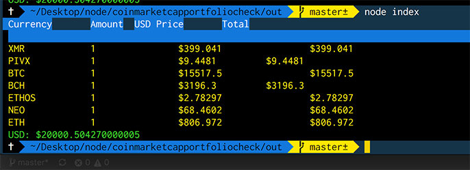

# Coinmarketcap.com portfolio value check
Simple project finds the latest price on coinmarket cap and adds them up to show a total investment

### To use
1. `npm install`  run this once
2. `npm run dist`  run this when made a change 
3. `cd ./out`
4. `node index` run this to run the app

Here's how it should look

### how to find tickers?
1. go to http://coinmarketcap.com
2. open a currency (for example https://coinmarketcap.com/currencies/bitcoin/)
3. the ticker is the `bitcoin` portion of the url
